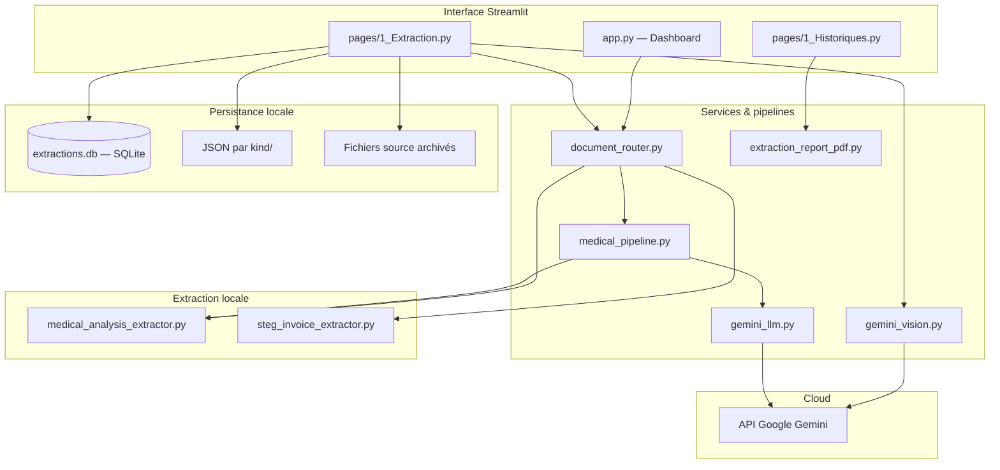

# Documentation du projet pfaEXTRACT

Ce document décrit **l’état réel du dépôt** : structure des fichiers, flux de données, persistance, interface web et lien avec la vision d’architecture à plus long terme.

Documents complémentaires :

- [`ARCHITECTURE.md`](./ARCHITECTURE.md) — vision **cible** (doctorat) : pipeline complet, PostgreSQL, API, etc. **Non entièrement implémentée** dans le code actuel.
- [`GUIDE_COMPLET.md`](./GUIDE_COMPLET.md) — guide pédagogique (rôles Streamlit / services, pièges).
- [`RAPPORT_ET_SOUTENANCE_PFA.md`](./RAPPORT_ET_SOUTENANCE_PFA.md) — éléments de soutenance.

---

## 1. Objectif du projet

**pfaEXTRACT** est une plateforme d’**extraction d’informations structurées** à partir de documents hétérogènes (images, PDF) :

- **Analyses médicales** (comptes rendus de laboratoire) : OCR local ± enrichissement **Gemini**, ou extraction **vision JSON** (Gemini uniquement).
- **Factures STEG** (Tunisie) : Gemini vision ou extracteur OCR / règles.
- **Tickets de caisse** : Gemini vision (JSON).

Les résultats sont affichés dans une application **Streamlit**, enregistrés en **historique** (fichiers JSON + index **SQLite**), avec export **PDF** type rapport (ReportLab).

---

## 2. Architecture : cible vs réelle

### 2.1 Vision cible (`ARCHITECTURE.md`)

Chaîne idéale : *Collecte → Prétraitement → OCR → Extraction → Validation → Stockage relationnel → API / Dashboard analytique*.

### 2.2 Architecture implémentée aujourd’hui

Il n’y a **pas** d’API REST séparée ni de PostgreSQL : **Streamlit** exécute le Python côté serveur et appelle directement les services.



**Résumé** : l’utilisateur uploade un fichier → routage / pipeline → JSON structuré → affichage, sauvegarde (SQLite + disque), téléchargement PDF optionnel.

---

## 3. Arborescence du dépôt (réelle)

```text
pfaEXTRACT/
├── .env.example                 # Modèle variables d’environnement
├── .gitignore
├── .streamlit/config.toml       # Config Streamlit
├── requirements.txt             # Dépendances Python
├── run_web.ps1                  # Exemple lancement Windows
├── README.md
├── data/                        # Dossier par défaut (config) : sous-dossiers raw, history, etc.
│   └── history/
│       ├── extractions.db       # SQLite (index + payload JSON en ligne)
│       └── extractions/         # JSON + sources archivées par type
│           ├── medical_gemini/
│           ├── medical_ocr/
│           ├── receipt/
│           ├── steg_gemini/
│           └── steg_ocr/
├── Data/                        # Peut coexister (ex. jeux d’essai) — attention casse Windows
├── docs/
│   ├── DOCUMENTATION_PROJET.md  # Ce fichier
│   ├── ARCHITECTURE.md
│   ├── GUIDE_COMPLET.md
│   └── RAPPORT_ET_SOUTENANCE_PFA.md
├── pipelines/                   # Scripts réutilisables / CLI Gemini vision JSON
│   ├── extract_medical_report_gemini.py
│   ├── extract_receipt_gemini.py
│   ├── extract_steg_invoice_gemini.py
│   ├── run_medical_extraction.py
│   ├── run_pipeline.py
│   └── run_steg_extraction.py
└── src/
    ├── config.py                # AppConfig, chemins, .env, Gemini
    ├── main.py                  # CLI extraction médicale (OCR ± Gemini)
    ├── gemini_vision.py         # Client google-genai, JSON vision
    ├── gemini_models.py         # Fallback noms de modèles
    ├── models/schemas.py        # Pydantic (MedicalDocumentResult, LabTest, …)
    ├── extraction/
    │   ├── medical_analysis_extractor.py   # OCR + règles analyses médicales
    │   └── steg_invoice_extractor.py       # OCR / règles facture STEG
    ├── services/
    │   ├── document_router.py       # Détection type + orchestration
    │   ├── medical_pipeline.py      # Fichier → OCR / Gemini merge
    │   ├── gemini_llm.py            # Prompt schéma médical (google-generativeai)
    │   ├── extraction_history.py    # save_extraction, list_history_entries
    │   └── extraction_report_pdf.py # PDF rapport DOCEXTRACT (ReportLab)
    ├── utils/logger.py
    └── web/
        ├── app.py                   # Dashboard + détail extraction
        ├── ui_theme.py              # Styles CSS partagés Streamlit
        ├── history_views.py         # render_extraction_detail, tableaux médicaux
        └── pages/
            ├── 1_Extraction.py      # Upload, modes, résultats, sauvegarde
            └── 1_Historiques.py   # Filtres, liste, détail, PDF
```

> **Note chemins** : `AppConfig` résout `project_root` puis `data/…` par défaut. Les variables `EXTRACTION_HISTORY_DIR` et `EXTRACTION_HISTORY_DB_PATH` peuvent rediriger vers un autre dossier (ex. `Data/history/…` sur votre machine).

---

## 4. Modules principaux

### 4.1 Configuration — `src/config.py`

- `load_dotenv` sur `.env` à la racine du projet et répertoire courant.
- Chemins : `data_raw_dir`, `data_output_dir`, **`extraction_history_dir`**, **`extraction_history_db_path`**, etc.
- `GEMINI_API_KEY` / `GOOGLE_API_KEY`, `GEMINI_MODEL`, `TESSERACT_CMD`, flags OCR.

### 4.2 Routage — `src/services/document_router.py`

- **`detect_document_type`** : heuristiques nom de fichier + OCR léger (mots-clés STEG / ticket / médical).
- **`process_any_document`** : modes `auto`, `medical`, `steg`, `receipt` ; branche vers pipelines Gemini vision ou `process_medical_file` / extracteurs STEG.

### 4.3 Médical — `src/services/medical_pipeline.py` + `src/extraction/medical_analysis_extractor.py`

- Image : OCR → structure **`MedicalDocumentResult`** (Pydantic).
- Option Gemini (`google-generativeai`) : fusion avec le texte / image via `gemini_llm.py`.
- PDF : texte `pypdf` + première page en image pour OCR / vision.

### 4.4 Gemini vision JSON — `src/gemini_vision.py` + `pipelines/extract_*.py`

- Utilisé par la page **Extraction** pour médical « simple », ticket, STEG.
- Réponse JSON contrôlée (`response_mime_type=application/json`), retries / fallback modèles.

### 4.5 STEG OCR — `src/extraction/steg_invoice_extractor.py`

- Logique lourde OCR / mise en forme image (OpenCV, etc.) pour factures STEG sans Gemini.

### 4.6 Modèles de données — `src/models/schemas.py`

- **`MedicalDocumentResult`** : `lab_info`, `patient_info`, `document_metadata`, liste **`LabTest`**, `warnings`, `extraction_source`.
- Sorties Gemini « page simple » : dictionnaires JSON (pas toujours instanciés en Pydantic dans l’UI).

### 4.7 Historique — `src/services/extraction_history.py`

| Mécanisme | Rôle |
|-----------|------|
| **`save_extraction`** | Écrit `{history_dir}/{kind}/{timestamp}_{stem}.json` ; optionnellement archive **`source_bytes`** à côté ; insère une ligne dans **SQLite** avec le JSON complet dans `payload_json`. |
| **`list_history_entries`** | Si **`extractions.db`** existe et est lisible : lit la table `extraction_history` (tri par `saved_at`). Sinon fallback : scan récursif des `*.json` sous `extraction_history_dir`. |

**Table SQLite `extraction_history`** : `id`, `kind`, `source_filename`, `saved_at`, `relative_path`, `payload_json`.

**Kinds** typiques : `receipt`, `medical_gemini`, `medical_ocr`, `steg_gemini`, `steg_ocr`.

### 4.8 Rapport PDF — `src/services/extraction_report_pdf.py`

- **`build_extraction_report_pdf(data, kind)`** : PDF A4 style bannière DOCEXTRACT, métadonnées, blocs selon le type (médical : tableau **Analyse / Valeur / Unité** uniquement pour les résultats).

### 4.9 Interface web — `src/web/`

| Fichier | Rôle |
|---------|------|
| **`app.py`** | Page **Dashboard** : métriques sur l’historique, tableau, détail, téléchargement rapport PDF. |
| **`pages/1_Extraction.py`** | Upload, mode (auto / médical / STEG / ticket), clé API, résultats, sauvegarde historique, PDF après succès. |
| **`pages/1_Historiques.py`** | Filtres, liste d’entrées, bouton **Voir**, détail, téléchargements (rapport PDF, original, PDF image si applicable). |
| **`history_views.py`** | `render_extraction_detail` par `kind` ; tableaux médicaux 3 colonnes via `medical_results_df`. |
| **`ui_theme.py`** | `inject_app_styles()` — styles Streamlit partagés. |

**Lancement** : `streamlit run src/web/app.py` — navigation multi-pages via le menu Streamlit.

### 4.10 CLI — `src/main.py`

- Extraction médicale depuis un chemin fichier : OCR, option `--gemini`, `--output` JSON.

---

## 5. Flux utilisateur (Extraction)

1. Choisir le **mode** (auto ou type forcé) et éventuellement la clé / modèle Gemini.
2. Uploader **image** ou **PDF** (selon le flux, STEG/ticket peuvent exiger une image).
3. Le backend exécute `document_router` / pipelines.
4. Affichage tableaux + JSON ; en cas de succès : **`save_extraction`** (JSON + SQLite + copie source si fournie).
5. Téléchargement **rapport PDF** (ReportLab) selon les pages.

---

## 6. Technologies (résumé)

| Domaine | Librairies |
|---------|------------|
| UI | Streamlit |
| Données | Pydantic, pandas |
| OCR / image | pytesseract, OpenCV, pdf2image, Pillow, pypdf |
| LLM | `google-genai`, `google-generativeai` |
| Fuzzy / texte | rapidfuzz |
| OCR secours | EasyOCR (optionnel, STEG) |
| PDF rapport | reportlab |
| Config | python-dotenv |
| Persistance | **sqlite3** (stdlib) + fichiers **JSON** |

---

## 7. Variables d’environnement (principales)

Voir **`.env.example`**. Les plus utilisées :

| Variable | Description |
|----------|-------------|
| `GEMINI_API_KEY` | Clé Google AI Studio |
| `GEMINI_MODEL` | Ex. `gemini-2.5-flash` |
| `EXTRACTION_HISTORY_DIR` | Dossier racine des JSON + sous-dossiers `kind` |
| `EXTRACTION_HISTORY_DB_PATH` | Chemin fichier `.db` SQLite |
| `TESSERACT_CMD` | Exécutable Tesseract (Windows par défaut dans `config.py`) |
| `DATA_*` | Répertoires données brutes / sorties (si surchargés) |

---

## 8. Prérequis système

- **Python 3.10+**
- **Tesseract** installé (chemin configurable).
- **Poppler** pour `pdf2image` (PDF → image) si vous traitez des PDF.
- Compte / clé **Gemini** pour les flux cloud.

Installation : `python -m pip install -r requirements.txt`

---

## 9. Évolution possible (alignement `ARCHITECTURE.md`)

Pistes hors périmètre actuel : API REST, base PostgreSQL, prétraitement image avancé versionné, évaluation quantitative sur annotations, dashboard analytique découplé.

---

*Document à tenir à jour lors d’ajouts majeurs (nouveaux types de documents, nouveau stockage, nouvelles pages).*
